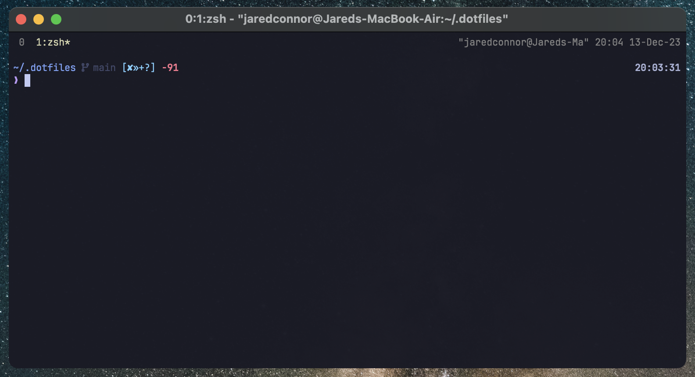

# Dotfiles

> Personal dotfiles configuration for Zsh, Git, Neovim, and more to rapidly
> bootstrap a new system.



| Component    | Tool                                                                    | Config                          |
| ------------ | ----------------------------------------------------------------------- | ------------------------------- |
| Installation | [Dotbot](https://github.com/anishathalye/dotbot)                        | [config](./install.conf.yaml)   |
| Shell        | [Zsh](https://www.zsh.org/)                                             | [config](./shell/zsh/)          |
| Prompt       | [Starship](https://starship.rs/)                                        | [config](./shell/starship.toml) |
| .zshrc       | [oh-my-zsh](https://github.com/robbyrussell/oh-my-zsh)                  | [config](./zsh/zshrc.zsh)       |
| Tools        | [Tmux](https://github.com/tmux/tmux/wiki), [asdf](https://asdf-vm.com/) | [config](./tools)               |

## [Makefile](./Makefile)

- Install with dotbot
- Homebrew save/restore
- VS Code extension save/restore
- Install MacOS defaults

## Usage

_Prerequisites: python, git, zsh_

### Installation

```sh
git clone git@github.com:denolfe/dotfiles.git .dotfiles --recursive
cd .dotfiles
make install
```

### Other Tasks

_[See Makefile](./Makefile)_
