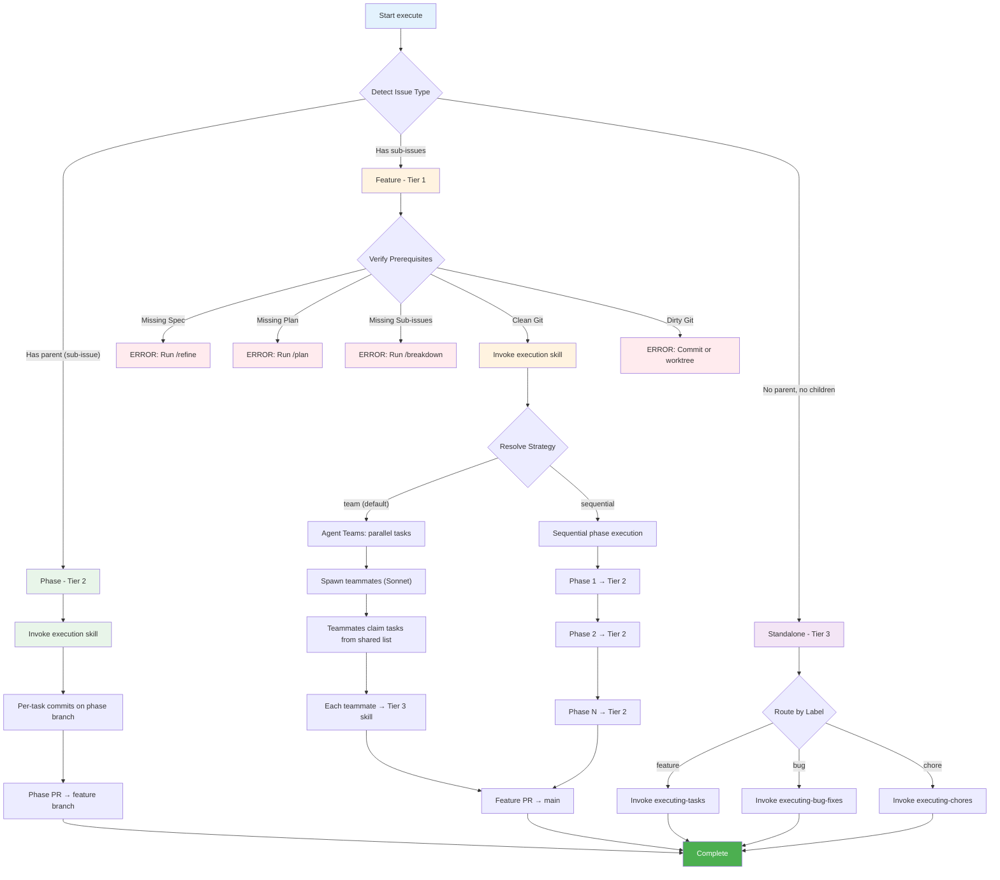

# Execute - Implementation Execution Command

Detect issue type (feature, phase, or standalone) and route to the appropriate execution tier.

## Usage

```bash
/execute <issue-id>                        # Execute any issue (default: team strategy)
/execute <issue-id> --strategy sequential  # Force sequential execution
/execute <issue-id> --strategy team        # Explicit team execution (default)
/execute <issue-id> --local                # Execute from local .agents/config.yaml
/execute --local                           # Execute from saved state (issue_id read from config)
```

## Overview

Detects the issue type and execution mode, then routes to the correct execution tier:

1. **Feature (parent with sub-issues):** Invoke `execution` skill (Tier 1)
2. **Phase (sub-issue with parent):** Invoke `execution` skill (Tier 2) directly
3. **Standalone (no parent, no children):** Route by label to Tier 3 directly

## Requirements

**Feature issues MUST have:**

- Specification section (from `/refine`)
- Technical Plan section (from `/plan`)
- Sub-issues / phases (from `/breakdown`)

**Phase issues MUST have:**

- Parent feature issue with Specification + Technical Plan
- Task checklist in phase description

**Repository MUST have:**

- Clean working directory or git worktree
- Justfile with test/lint/format (recommended)

**Team strategy prerequisites:**

- `CLAUDE_CODE_EXPERIMENTAL_AGENT_TEAMS=1` environment variable set
- Interactive mode (not headless/conductor)
- Phase with multiple tasks (single-task phases auto-fallback to sequential)

**Automatic fallback to sequential:** If agent teams are not enabled, running in headless/conductor mode, or the phase has only one task, execution automatically falls back to sequential strategy.

## Workflow



## How It Works

### Step 1: Detect Execution Mode & Issue Type

```python
local_flag = '--local' in flags
# issue_id may be None (allowed in local mode — read from state)
issue_id = parse_issue_id(flags)

state = read_workflow_state()   # from local-task-store skill

# Detect issue change (only if issue_id was explicitly passed)
if issue_id:
    changed, old_id = detect_issue_change(issue_id)
    if changed:
        WARN: "Previously working on {old_id}. Starting fresh for {issue_id}."
        reset_workflow_state(issue_id)
        state = {'issue_id': issue_id}
elif not issue_id:
    # No issue_id passed — read from saved state
    issue_id = state.get('issue_id')
    if not issue_id:
        ERROR: "No issue ID provided and no saved workflow state found."
        SUGGEST: "Run /execute <issue-id> or /execute --local <issue-id>"
        STOP

# Inherit --local from saved state (or phases[] presence)
local_mode = is_local_mode({'local': local_flag})   # uses canonical local-task-store logic
if local_mode and not local_flag:
    INFO: "--local inherited from saved workflow state"

if local_mode:
    # Local mode: read from .agents/config.yaml
    config = yaml_load('.agents/config.yaml')
    # Pass local_mode flag to execution skill
    Skill(execute, flags={'local': True})
else:
    # PM mode: detect issue type from Linear/JIRA
    issue = mcp__linear-server__get_issue(id=issue_id)
    sub_issues = mcp__linear-server__list_issues(parentId=issue.id)

    if issue.parent:
        # This is a phase (sub-issue) - execute directly via Tier 2
        Skill(execute)
    elif len(sub_issues) > 0:
        # This is a feature (parent) - execute via Tier 1
        Skill(execute)
    else:
        # Single issue with no parent/children - treat as standalone task
        # Route by label to Tier 3 directly
        Skill(executing-{label})
```

### Step 2a: Feature Execution (Tier 1)

```bash
# Verify prerequisites first
parent = mcp__linear-server__get_issue(id=issue_id)

# Verify sections
if "## Specification" not in parent.description:
    ERROR: Run `/refine <issue-id>` first
if "## Technical Plan" not in parent.description:
    ERROR: Run `/plan <issue-id>` first

# Check working directory
git_status = git status --porcelain
if git_status not empty:
    ERROR: Uncommitted changes
    SUGGEST: Commit, stash, or use git worktree

# Pass strategy to Tier 1 orchestration
Skill(execute)
# Strategy is resolved inside the skill based on:
# - Explicit --strategy flag
# - Config (execution.strategy in dlc.local.md)
# - Auto-fallback: sequential if single task, no agent teams, or conductor mode
```

The skill handles phase execution using either team strategy (Agent Teams for parallel tasks) or sequential strategy (dispatching each phase to Tier 2), plus PR creation and status updates.

### Step 2b: Phase Execution (Tier 2)

```bash
# Load phase issue and parent context
phase = mcp__linear-server__get_issue(id=issue_id)
parent = mcp__linear-server__get_issue(id=phase.parent.id)

# Invoke Tier 2 directly
Skill(execute)
```

The skill handles per-task commits on the phase branch, dispatching tasks to Tier 3 skills, and creating the phase PR.

### Step 2c: Standalone Execution (Tier 3)

```bash
# Detect label and route directly
issue = mcp__linear-server__get_issue(id=issue_id)
label = get_task_label(issue)  # feature, chore, or bug

# Route to appropriate Tier 3 skill
if label == 'feature':
    Skill(executing-tasks)
elif label == 'bug':
    Skill(executing-bug-fixes)
elif label == 'chore':
    Skill(executing-chores)
```

### Step 3: Update Issue Status

Always ensure issue status is updated during the implementation process:
- Set status to `In Progress` when starting implementation
- Set status to `In Review` once implementation is complete and PR has been created
- If there is no PR then set status to `Done`

### Step 4: Persist Workflow State

```python
write_workflow_state({
    'phase': 'execute_complete',
    'issue_id': issue_id,
    'flags': {'local': local_mode}
})
```

## Error Handling

**Missing Prerequisites:** Run `/refine`, `/plan`, `/breakdown` in order before `/execute` on a feature.

**Dirty Working Directory:** Commit, stash, or use git worktree before executing.

**No Sub-Issues on Feature:** Run `/breakdown <issue-id>` to create phases first.

## Example

```bash
# Feature execution with team strategy (default)
/execute AUTH-100

# Output:
# Loaded AUTH-100: "User authentication"
# Detected: Feature (3 phases found)
# ✓ Specification found
# ✓ Technical Plan found
# ✓ 3 phases found
# Strategy: team (Agent Teams enabled)
# Using execution skill (Tier 1)...
# → Phase 1: Register endpoint (4 tasks)
#   Spawning 4 teammates (Sonnet)...
#   Teammates claiming tasks from shared list...
#   ✓ All 4 tasks complete (parallel)
# → Phase 2: Login endpoint (3 tasks)
#   Spawning 3 teammates (Sonnet)...
#   ✓ All 3 tasks complete (parallel)
# → Phase 3: Token refresh (2 tasks)
#   Spawning 2 teammates (Sonnet)...
#   ✓ All 2 tasks complete (parallel)
# ✓ All 3 phases complete (9 tasks total)
# ✓ 42 tests passing
# Create feature PR now? (yes/no)
# > yes
# ✓ PR created: https://github.com/org/repo/pull/145

# Feature execution with sequential strategy
/execute AUTH-100 --strategy sequential

# Output:
# Loaded AUTH-100: "User authentication"
# Detected: Feature (3 phases found)
# Strategy: sequential
# Using execution skill (Tier 1)...
# → Phase 1: Register endpoint (4 tasks) [sequential]
# → Phase 2: Login endpoint (3 tasks) [sequential]
# → Phase 3: Token refresh (2 tasks) [sequential]
# ✓ All 3 phases complete (9 tasks total)
# ✓ PR created: https://github.com/org/repo/pull/145

# Phase execution (Tier 2 → Tier 3 directly)
/execute AUTH-101

# Output:
# Loaded AUTH-101: "Phase 1: Register endpoint"
# Detected: Phase (parent: AUTH-100)
# Using execution skill (Tier 2)...
# → Task 1: Add user model
# → Task 2: Add validation
# → Task 3: Add endpoint
# → Task 4: Add integration tests
# ✓ All 4 tasks complete
# ✓ Phase PR created: feature/AUTH-100-auth/phase-1-register → feature/AUTH-100-auth

# Standalone execution (Tier 3 directly)
/execute AUTH-500

# Output:
# Loaded AUTH-500: "Fix password reset timeout"
# Detected: Standalone (label: bug)
# Using executing-bug-fixes skill (Tier 3)...
# ✓ Bug fix complete
# ✓ 3 tests passing
```

## Integration

**Requires:**
- PM system (Linear/JIRA) MCP **or** `--local` flag with `.agents/config.yaml`
- GitHub CLI authenticated

**Feature execution also requires:** Parent issue with Specification + Technical Plan + phases (PM mode), or config.yaml with phases (local mode).

**Uses:** Subagents for implementation, code review per task, automatic status updates, PR creation.

## Remember

- Command detects issue type and routes to correct tier
- **`--local` mode:** Read tasks from config.yaml, track progress in state.yaml, sync phase status to Linear only
- **Auto-inherit local:** `--local` is persisted in `dev_state.flags.local` after the first command that uses it. Subsequent commands inherit it automatically without re-passing the flag.
- Feature (Tier 1) → Phase (Tier 2) → Task (Tier 3) hierarchy
- `--strategy team` (default): Agent Teams for parallel task execution within phases
- `--strategy sequential`: Traditional Tier 2 subagent dispatch (one task at a time)
- Auto-fallback to sequential: single-task phases, no agent teams env var, conductor mode
- Subagents/teammates get full context (WHAT + HOW + TDD checklist)
- Tests and implementation together (not split)
- Clean working directory required
- Respects completed phases and tasks (resumable via state.yaml in local mode, via PM in default mode)
- `--pr-strategy stacked (default)|feature` controls PR structure
