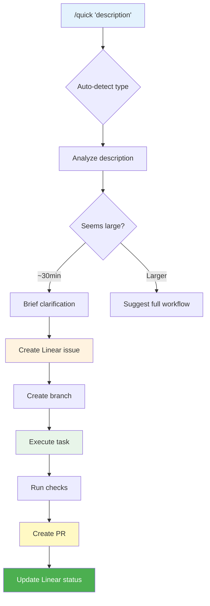

# Quick - Lightweight Task Execution

Execute small tasks with minimal overhead. Creates a Linear issue for tracking, runs brief clarification, then executes immediately.

## Usage

```bash
/quick "Fix the typo in the login button"
/quick "Update the copyright year in footer"
/quick "Add loading spinner to submit button"
```

## Overview

The quick command is designed for small tasks (~30 min or less) that don't need the full HITL workflow:

1. **Auto-detect type** (bug/chore/feature) from description
2. **Brief clarification** (1-2 questions if needed)
3. **Scope check** (warn if seems larger than ~30 min)
4. **Create Linear issue** for tracking
5. **Execute immediately** (branch + PR)

## Workflow



## Process

### Step 1: Parse and Analyze

```python
def analyze_quick_task(description: str) -> dict:
    """Analyze task description for type and scope."""
    text = description.lower()

    # Auto-detect type
    bug_signals = ['fix', 'bug', 'error', 'broken', 'crash', 'issue']
    chore_signals = ['update', 'upgrade', 'refactor', 'cleanup', 'deps', 'config']

    task_type = 'feature'
    for signal in bug_signals:
        if signal in text:
            task_type = 'bug'
            break
    for signal in chore_signals:
        if signal in text:
            task_type = 'chore'
            break

    # Scope estimation heuristics
    large_signals = ['refactor', 'redesign', 'rewrite', 'migrate', 'integration',
                     'authentication', 'authorization', 'api', 'database']
    seems_large = any(signal in text for signal in large_signals)

    return {
        'type': task_type,
        'seems_large': seems_large,
        'description': description
    }
```

### Step 2: Scope Check

If the task seems larger than ~30 minutes:

```markdown
This task might be larger than a quick fix:
- "refactor the authentication system"

Consider using the full workflow instead:
1. `/refine` - Define requirements
2. `/plan` - Technical approach
3. `/breakdown` - Split into sub-tasks
4. `/execute` - Implement with TDD

Continue with quick execution anyway? (yes/no)
```

### Step 3: Brief Clarification

Ask 1-2 targeted questions based on type:

**For bugs:**
```markdown
Quick clarification:
1. Can you describe the expected vs actual behavior?
2. Is there a specific file or component affected?
```

**For chores:**
```markdown
Quick clarification:
1. Any specific version or target for this update?
```

**For features:**
```markdown
Quick clarification:
1. Where should this appear in the UI/codebase?
```

### Step 4: Create Linear Issue

```python
def create_quick_issue(analysis: dict, clarification: dict, config: dict) -> dict:
    """Create Linear issue for quick task tracking."""
    title = analysis['description']
    task_type = analysis['type']

    description = f"""## Quick Task

{analysis['description']}

### Clarification
{format_clarification(clarification)}

### Scope
Estimated: ~30 minutes or less

---
*Created via `/quick`*
"""

    issue = mcp__linear_server__create_issue(
        team=config['team'],
        title=title,
        description=description,
        labels=[task_type]
    )

    return issue
```

### Step 5: Execute Task

```python
def execute_quick_task(issue: dict, config: dict):
    """Execute quick task with branch + PR workflow."""
    issue_id = issue['identifier']

    # Create branch
    branch_name = f"quick/{issue_id}-{slugify(issue['title'][:30])}"
    run(f"git checkout -b {branch_name}")

    # Update issue status
    mcp__linear_server__update_issue(id=issue['id'], state='In Progress')

    # Execute based on type
    task_type = get_label(issue)

    if task_type == 'bug':
        # Use bug-fix workflow (simplified)
        execute_bug_fix_quick(issue)
    elif task_type == 'chore':
        # Use chore workflow (simplified)
        execute_chore_quick(issue)
    else:
        # Use feature workflow (simplified)
        execute_feature_quick(issue)

    # Run checks
    run("just lint && just test")

    # Create PR
    create_quick_pr(issue, branch_name)

    # Update issue status
    mcp__linear_server__update_issue(id=issue['id'], state='In Review')
```

### Step 6: Create PR

```python
def create_quick_pr(issue: dict, branch_name: str):
    """Create minimal PR for quick task."""
    issue_id = issue['identifier']
    title = issue['title']

    body = f"""## Quick Task: {title}

Resolves {issue_id}

### Changes
[Auto-generated summary of changes]

### Verification
- [ ] Tests pass
- [ ] Lint clean

---
*Created via `/quick`*
"""

    run(f'gh pr create --title "{title}" --body "{body}"')
```

## Examples

### Bug Fix
```bash
/quick "Fix login button not responding on mobile"

# Output:
# Detected type: bug
# Brief clarification:
# > What's the expected behavior?
# "Button should submit the form"
# > Specific component?
# "src/components/LoginForm.tsx"
#
# Creating issue AIFE-215...
# Creating branch quick/AIFE-215-fix-login-button...
# Implementing fix...
# Running checks... ✓
# Creating PR... ✓
# Done! PR: https://github.com/org/repo/pull/42
```

### Chore
```bash
/quick "Update footer copyright to 2025"

# Output:
# Detected type: chore
# No clarification needed for simple update.
#
# Creating issue AIFE-216...
# Creating branch quick/AIFE-216-update-footer-copyright...
# Making change...
# Running checks... ✓
# Creating PR... ✓
# Done! PR: https://github.com/org/repo/pull/43
```

### Scope Warning
```bash
/quick "Refactor the authentication system"

# Output:
# ⚠️ This task might be larger than a quick fix.
#
# Consider using the full workflow:
# - /refine AIFE-XXX
# - /plan AIFE-XXX
# - /breakdown AIFE-XXX
# - /execute AIFE-XXX
#
# Continue with quick execution anyway? (yes/no)
```

## Configuration

The quick command uses project configuration from `.claude/conductor.local.md` or `~/.dlc-conductor/config.yml`:

```yaml
team: "AI-First Engineering"
quick:
  scope_warning_threshold: 30  # minutes
  skip_clarification_for: ["simple updates", "typo fixes"]
  auto_merge: false  # Require PR review
```

## Remember

- Quick tasks should be ~30 minutes or less
- Auto-detects type (bug/chore/feature) from description
- Creates Linear issue for tracking
- Uses branch + PR workflow (isolated, traceable)
- Warns if task seems too large for quick path
- Runs lint and tests before PR
